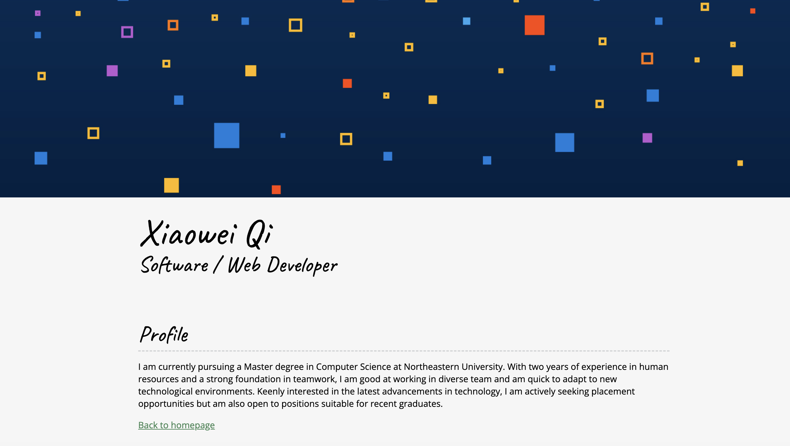

# My Personal Website 🌟  
Welcome to my personal website! This project is my way of showcasing my journey, experiences, and passions in web and app development. 🚀

## 🌐 Live Demo  
Check it out here: [My Personal Web](https://citrine-tide-fairy.glitch.me/)

---

## 📋 Project Objectives  
This project was created to:  
1. Share my educational and professional background.  
2. Highlight the projects I’ve worked on and the certifications I’ve earned.  
3. Provide a platform for networking and sharing ideas with others in the tech community.  

---

## 📸 Screenshots  
### Desktop View 💻  


### Mobile View 📱  


---

## 🛠️ Features  
- **Responsive Design**: Seamless viewing experience on all devices with a combination of grid, flexbox layouts, and media queries.  
- **Interactive Elements**: Easy-to-navigate interface with engaging animations and user-friendly design.  
- **Portfolio Section**: Showcasing key projects with descriptions and links for more details.  

---

## 🛠️ Tech Stack  
- **HTML5**: For semantic and structured content.  
- **CSS3**: For responsive design and visual styling using flexbox, grid, and media queries.  
- **JavaScript**: For interactive elements and dynamic user experiences.  

---

## 🚀 Build Instructions  
To run the project locally:  
1. Clone the repository:  
   ```bash  
   git clone https://github.com/your-username/personal-website.git  
   ```  
2. Navigate to the project directory:  
   ```bash  
   cd personal-website  
   ```  
3. Open the `index.html` file in your browser to view the website.  

---
## ✨ Future Improvements  
- Adding a blog section to share tips and experiences in web development.  
- Implementing a contact form for easier communication.  
- Enhancing animations and transitions for a smoother experience.  

---

## 🧑‍💻 Author  
**Xiaowei Qi**  
- Passionate about web and app development, with certifications to back it up!  
- Always learning and looking for ways to innovate and create value.  

---

## 🤝 Connect with Me  
- LinkedIn: [Your LinkedIn Profile](https://www.linkedin.com/in/your-profile)  
- Portfolio Website: [My Personal Web](# My Personal Website 🌟  
Welcome to my personal website! This project is my way of showcasing my journey, experiences, and passions in web and app development. 🚀

## 🔮 Use of GenAI Tools
This project leveraged Generative AI (GenAI) tools to enhance efficiency and creativity during development. Below are the details:

1. Tools and Models Used
- Model: OpenAI GPT-4
- Version: January 2025 (Knowledge Cutoff: January 2025)
2. Prompts and Usage
   - Code Assistance:
      Used to debug and optimize JavaScript and CSS code for dynamic background generation and responsive design.
   - Documentation:
      Assisted in drafting sections of the README file, including structure recommendations and explanations of tools and settings.
   - Design Suggestions:
      Helped refine the user interface by suggesting styling tips for better visual appeal.
   - Code Review
      Provided debugging insights for runtime issues and ESLint configurations.
3. How It Helped
   - Time Efficiency: Reduced time spent on debugging and writing documentation.
   - Enhanced Learning: Provided explanations and insights to help better understand the technologies used.
   - Creativity Boost: Suggested creative ideas for styling and functionality improvements.
4. Transparency
All outputs from GenAI tools were reviewed and edited to ensure accuracy, relevance, and alignment with project goals.
