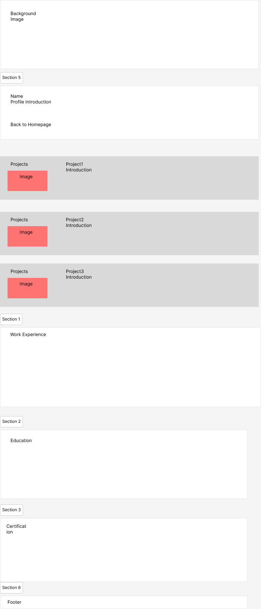

## Project Description
A personal resume website to showcase my software development skills, portfolio of projects, and work history to potential employers and clients.

## User Personas
1. Recruiters
    - Looking for candidates with relevant skill sets.
2. Hiring Managers
    - Interested in exploring work history and project details.
3. Peers and Network Connections
    - Seeking collaboration opportunities.

## User Stories
1. As a recruiter : I want to easily view and download the resume, so I can share it with my team.

2. As a hiring manager : I want to see a list of projects and achievements, to assess the candidate's suitability for the job.

3. As a peer : I want to read about the candidate’s skills and professional interests, to evaluate the potential for collaboration.

## Design Mockups

